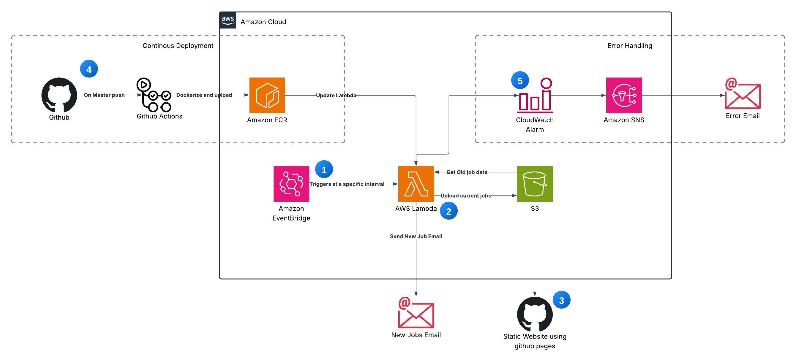

# All Seeing: Automated Job Post Alert System
This project is to help with job hunting. I was advised to try to be the first few people to apply to a new position. So I made this Python script. This script gets data from company job boards and checks if there is a new job post; if there is, then it sends an email about the new job. To make the most of this project, I recommend that you deploy this to AWS Lambda and have AWS EventBridge run this script every hour or less.

---

## Features

- **Monitors company job boards** for new postings
- **Sends email alerts** for newly listed jobs
- **Easy to extend**: Add new companies with minimal effort
- **Deployable to AWS Lambda** for automated, scheduled checks (recommended: every hour or less with AWS EventBridge)
  
## Companies Tracked

- Google
- Adobe
- Amazon
- Datadog
- Discord
- Meta
- Microsoft
- Netflix
- Nutanix
- Nvidia
- Oracle
- Palantir
- Paypal
- Walmart
- Apple
- Figma
  
---

## Quick Start

### 1. Environment Setup

- **Python Virtual Environment**
  Uses python 3.11
    ```
    python3 -m venv venv
    source venv/bin/activate  # On Windows: venv\Scripts\activate
    pip install -r requirements.txt
    ```
- **Docker (Optional)**
    - A `Dockerfile` is included for containerized deployment.


### 2. Email Notification Setup

- The script uses email to notify you about new job postings.

#### Configuration:

1. **Google App Password**
    - [Create a Google App Password](https://support.google.com/accounts/answer/185833?hl=en) for your Gmail account.

2. **`secrets.json` File**
    - Create a file named `secrets.json` in your project root:
      ```
      {
        "sender": "your_email@gmail.com",
        "password": "your_app_password"
      }
      ```

3. **Recipient Email**
    - Edit `helper/emailing.py` send_email() fucnction and set your preferred recipient email address.


### 3. Running the Project

After configuring email, run the script: ```python3 -m main```

---

## Architecture Overview



**How it Works:**

1. **Scheduled Execution:** Amazon EventBridge triggers the AWS Lambda function at regular intervals.
2. **Job Comparison & Notification:** Lambda compares the newly scraped jobs with previous data from S3 and sends email alerts if there are new jobs.
3. **Website Data:** Lambda uploads the current job data to an S3 bucket, which is used to power a static website (e.g., via GitHub Pages).
4. **Continuous Deployment:** Code changes pushed to GitHub trigger GitHub Actions, which Dockerize and deploy the application to AWS (via ECR and Lambda updates).
5. **Error Monitoring:** CloudWatch scans Lambda logs for 'ERROR'. On detection, an SNS topic sends a notification email with error details.

---

## How to Contribute

### Adding a New Company

1. **Create a Company Script**
    - In the `companies` folder, add a new file: `company_name.py`.

2. **Implement Required Functions**
    - Each script must define:
        - `extractor()`: Fetches and parses job postings.
        - `main()`: Compares the new responses to the previous responses to check for new job postings.
    - Include:
        ```
        if __name__ == "__main__":
            main()
        ```
    - For reference, see `adobe.py`.

#### Writing the Extractor

- Most job boards use APIs to serve job data.
- **Find the API Endpoint:**
    - Open browser DevTools → Network tab.
    - Look for API calls returning job data in JSON format.
- **Convert API Call to Python:**
    - Right-click the API call → Copy as cURL.
    - Use [curlconverter.com](https://curlconverter.com/) to convert cURL to Python.
- **Extractor Return Format:**
    ```
    {
      <jobid>: {
        "jobId": <jobid>,
        "url": <url>,
        "title": <title>
      },
      ...
    }
    ```

---

## Notes

- **Debugging:** Use `if __name__ == "__main__":` in your company modules for standalone testing. Run the code: python -m companies.company_name to debug.


